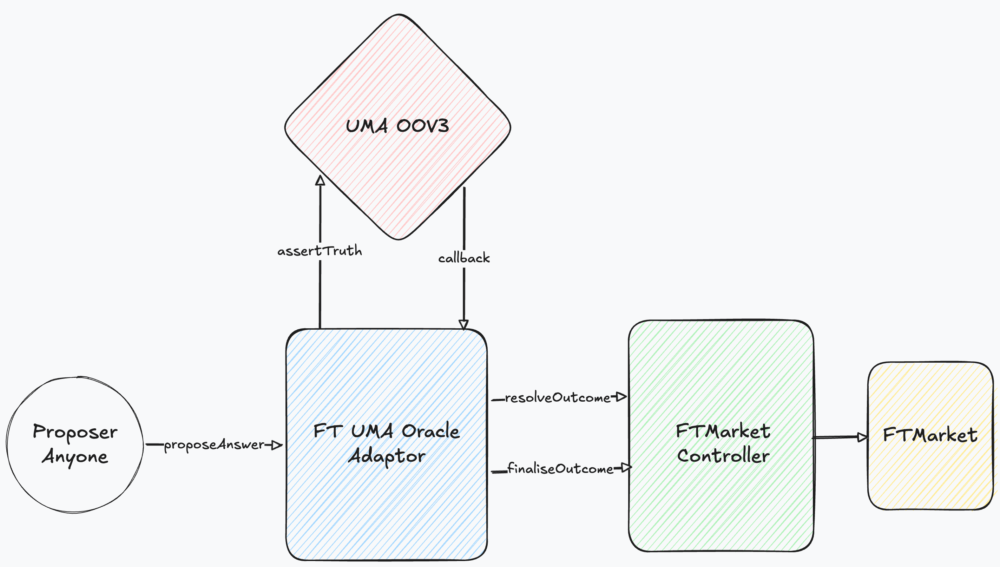

# FT UMA Oracle Adapter

> **Disclaimer:** This is an independent implementation for learning purposes. It is not affiliated with or endorsed by the FortyTwo protocol team. This codebase has been reviewed using Pashov AI auditor but has not gone through a manual security review. Do not use in production without a proper audit.

## Overview

This repository contains contracts used to resolve [FortyTwo](https://fortytwo.xyz/) prediction markets via UMA's [Optimistic Oracle V3](https://docs.uma.xyz/developers/optimistic-oracle-v3).

Uses V3's assertion model (`assertTruth`) instead of V2's request-response model (`requestPrice`). See [docs/design.md](./docs/design.md) for the comparison.

## Integration

Grant the adapter resolution roles on `FTMarketController`:

```solidity
controller.grantRole(QUESTION_RESOLVER_ROLE, address(adapter));
controller.grantRole(QUESTION_FINALISER_ROLE, address(adapter));
```

## Architecture



The Adapter holds `QUESTION_RESOLVER_ROLE` and `QUESTION_FINALISER_ROLE` on FortyTwo's `FTMarketController`. It fetches resolution data from UMA's Optimistic Oracle V3 and resolves the market based on said resolution data.

When a market expires, anyone can `proposeAnswer` on the Adapter:

1. The proposed answer and bond are forwarded to UMA via `assertTruth`
2. The assertion's parameters (questionId, answer, proposer) are stored onchain
3. Bond is returned directly to the proposer by UMA on truthful settlement

UMA Proposers post a bond alongside their assertion. If the assertion is not disputed, it settles as truthful after a defined liveness period (default: 2 hours).

When the assertion is disputed, the Adapter clears the pending proposal so the market is not stuck during UMA's [DVM](https://docs.uma.xyz/protocol-overview/dvm-2.0) resolution (48-72 hour vote). New proposals can be submitted while the DVM is voting.

After an assertion settles, UMA calls `assertionResolvedCallback` on the Adapter, which resolves and finalises the outcome on the `FTMarketController`.

### Emergency Resolution

An admin can `flag` a market for manual resolution. This pauses UMA-based resolution and starts a 1-hour safety period. After the safety period, the admin can call `emergencyResolve` to resolve the market directly.

## Docs

See [docs/](./docs/) for design rationale, flow diagrams, test coverage, and known issues.

## Development

Clone the repo: `git clone https://github.com/user/ft-uma-oracle-adapter.git --recurse-submodules`

---

### Set-up

Install [Foundry](https://github.com/foundry-rs/foundry/).

To build contracts: `forge build`

---

### Testing

To run all tests: `forge test`

Set `-vv` to see logs or `-vvv` for a stack trace on failed tests.
